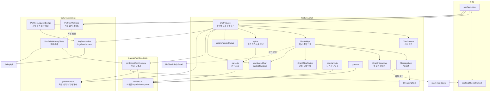
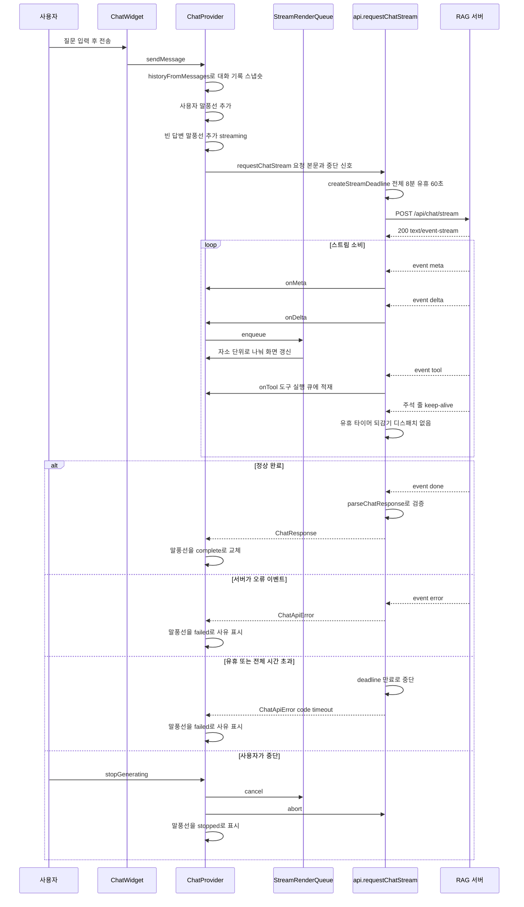
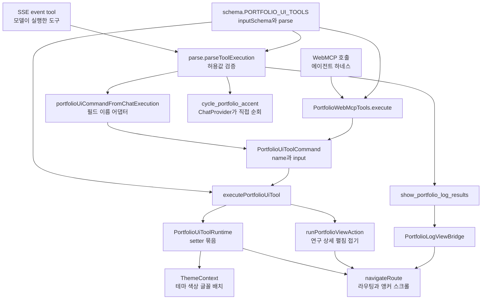
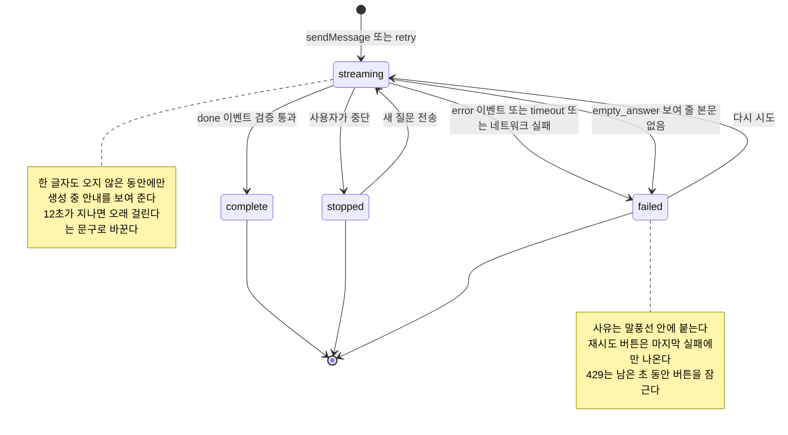
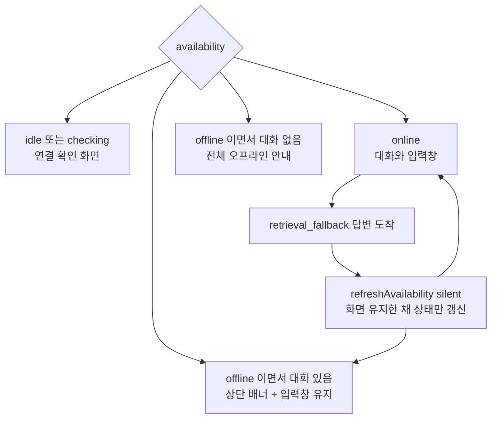

# 포트폴리오 챗봇 프런트엔드 구조

공개 포트폴리오에 붙어 있는 AI 챗봇의 프런트엔드 구조를 정리한 문서다.
백엔드(RAG 추론 서버)는 비공개 저장소에 있고, 이 저장소에는 브라우저에서
도는 코드만 있다.

읽는 순서는 아래 네 그림을 따라가면 된다. 모듈이 어떻게 나뉘어 있는지,
질문 하나가 어떤 경로로 흐르는지, 모델이 화면을 바꾸는 두 경로가 어디서
합쳐지는지, 실패했을 때 화면이 어떤 상태로 가는지 순서다.

---

## 1. 모듈 의존 그래프

- 챗봇 상태는 전부 `ChatProvider` 한 곳에 있고, `ChatWidget` 아래의 컴포넌트는
  받은 것을 그리기만 한다. 그래서 말풍선에 `memo`가 걸려도 안전하다.
- `schema.ts`가 도구 허용값의 단일 소스다. 파서·실행기·타입·WebMCP 입력
  스키마가 모두 여기서 파생돼, 한쪽만 고쳐 어긋나는 일이 생기지 않는다.
- 점선 세 개가 지연 로딩 경계다. 마크다운 렌더러는 채팅을 열 때, 젤리 엔진은
  패널이 열릴 때, WebMCP 도구 등록은 `document.modelContext`가 있을 때만 받는다.
- `api.ts`는 네트워크만, `parse.ts`는 검증만 맡는다. 파서에 런타임 의존이 없어
  `node --test`가 브라우저 없이 그대로 실행한다.

---

## 2. 질문 하나의 요청 시퀀스

- delta는 도착 즉시 렌더 큐에 넣고 네트워크 읽기는 멈추지 않는다. 화면 재생
  속도와 수신 속도를 분리해, 연출이 느려도 스트림이 밀리지 않게 한 것이다.
- `:`로 시작하는 주석 줄과 `event` 필드가 없는 블록은 디스패치하지 않는다.
  수신 자체가 생존 신호라 유휴 타이머만 되감는다.
- 시간 상한은 두 겹이다. 전체 8분은 처음부터 흐르고, 유휴 60초는 바이트가
  올 때마다 초기화된다. 만료로 끊긴 경우에만 `timeout` 코드가 붙어, 사용자
  중단과 다른 안내가 나간다.
- `done` 본문이 검증을 통과하지 못하거나 보여 줄 본문이 하나도 없으면
  `empty_answer`로 실패시킨다. 빈 말풍선이 화면에 굳는 것보다 낫다.

---

## 3. 도구 실행이 한곳으로 모이는 길

- 출발지는 둘이지만 도착지는 하나다. 챗봇이 지시한 것이든 에이전트가 호출한
  것이든 `PortfolioUiToolCommand`가 되어 같은 실행기를 지난다.
- 검증도 한곳이다. `schema.ts`의 허용 목록이 SSE 응답 파서와 WebMCP 입력
  파서 양쪽에 쓰여, "챗봇으로는 되는데 도구로는 안 되는" 차이가 생기지 않는다.
- 예외가 둘 있다. 포인트 색상 순회는 시간이 걸리는 연출이라 중단 신호를 함께
  다뤄야 해서 `ChatProvider`가 직접 처리하고, 기록 검색 결과 표시는 화면 설정
  변경이 아니라 목록 상태 준비라 이벤트로 다리를 건넌다.
- 그 다리(`PortfolioLogViewBridge`)는 WebMCP 지원 여부와 무관하게 항상 켜 둔다.
  챗봇만 쓰는 방문자도 같은 동작을 봐야 하기 때문이다.

---

## 4. 답변 말풍선과 연결 상태의 화면 상태 머신

- 답변 말풍선의 상태는 넷이다. 생성 중 안내는 `streaming`이면서 아직 본문이
  비어 있을 때만 나온다. 실패·중단 배지 아래에 "생성하고 있어요"가 함께 뜨면
  서로 모순된 안내가 되기 때문이다.
- 실패 사유는 하단 오류 상자가 아니라 그 말풍선 바로 아래에 붙는다. 어느
  질문이 실패했는지가 함께 보여야 재시도 판단이 선다.
- 연결 상태 안내는 대화 시작 여부로 무게가 갈린다. 대화 전에는 화면 전체를
  안내로 바꾸고, 대화 중에는 얇은 배너만 띄워 검색 기반 답변을 계속 받게 한다.
- 검색 기반 답변이 대화 중에 도착하면 배경에서 상태만 다시 확인한다. 이때
  "확인 중" 화면으로 넘어가지 않아 읽고 있던 대화가 가려지지 않는다.

---

## 관련 파일

| 관심사 | 파일 |
| --- | --- |
| 상태와 요청 수명주기 | `src/features/chat/ChatProvider.tsx` |
| 패널 셸과 연출 | `src/features/chat/ChatWidget.tsx` |
| 말풍선 · 온보딩 · 연결 안내 | `src/features/chat/MessageItem.tsx`, `ChatOnboarding.tsx`, `ChatOfflineNotice.tsx` |
| 네트워크와 SSE | `src/features/chat/api.ts` |
| 순수 파서와 그 테스트 | `src/features/chat/parse.ts`, `parse.test.mjs` |
| 도구 허용값 단일 소스 | `src/features/portfolio-tools/schema.ts` |
| 도구 실행기 | `src/features/portfolio-tools/portfolioUiToolExecutor.ts` |
| WebMCP 등록과 게이트 | `src/features/webmcp/PortfolioWebMcp.tsx`, `PortfolioWebMcpTools.tsx` |
| 화면 상태 읽기와 제어 | `src/features/webmcp/portfolioView.ts` |
| 기록 검색 결과 반영 | `src/features/webmcp/PortfolioLogViewBridge.tsx`, `logSearchView.ts` |
