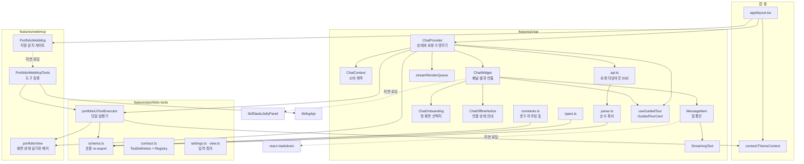
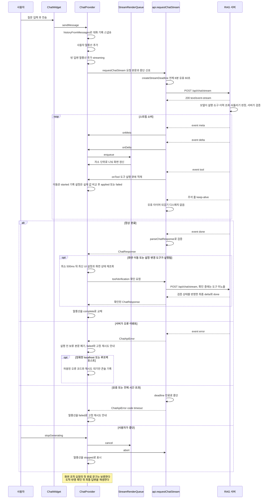
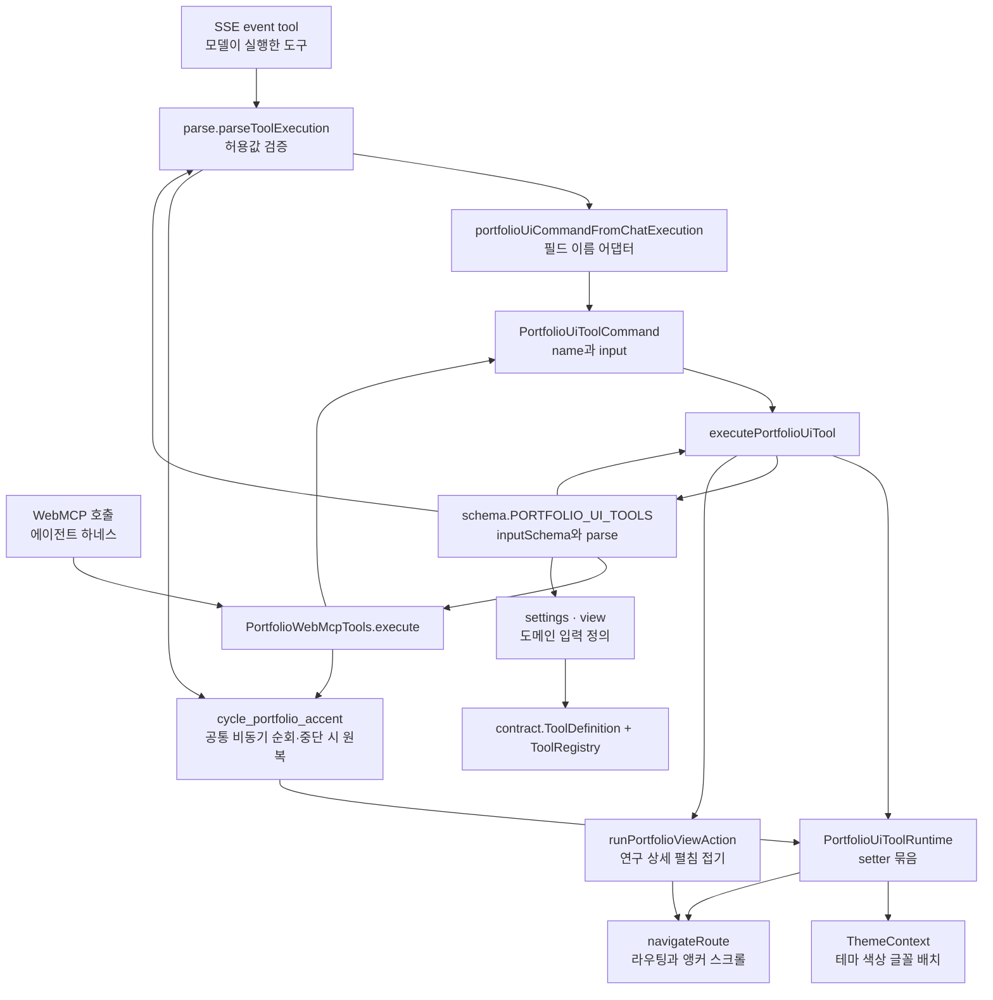
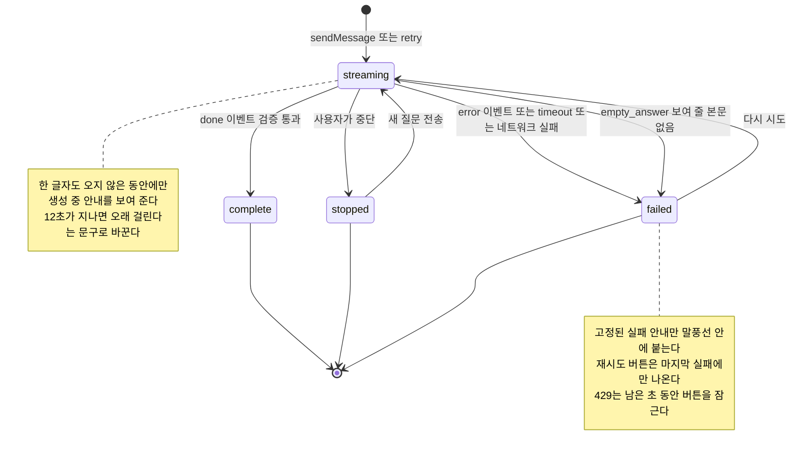
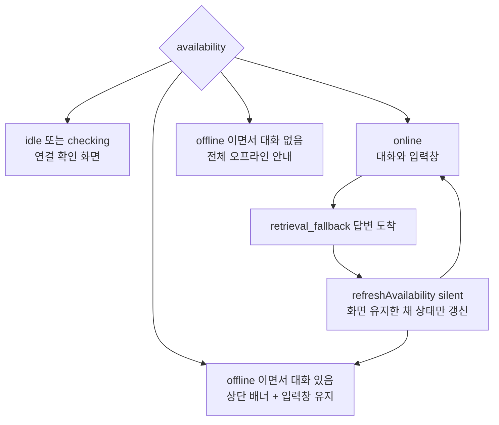

# 포트폴리오 챗봇 프런트엔드 구조

공개 포트폴리오에 붙어 있는 AI 챗봇의 프런트엔드 구조를 정리한 문서다.
백엔드(RAG 추론 서버)는 비공개 저장소에 있고, 이 저장소에는 브라우저에서
도는 코드만 있다.

읽는 순서는 아래 네 그림을 따라가면 된다. 모듈이 어떻게 나뉘어 있는지,
질문 하나가 어떤 경로로 흐르는지, 모델이 화면을 바꾸는 두 경로가 어디서
합쳐지는지, 실패했을 때 화면이 어떤 상태로 가는지 순서다.

---

## 1. 모듈 의존 그래프

```mermaid
flowchart TD
  subgraph shell["앱 셸"]
    Layout["app/layout.tsx"]
    Theme["context/ThemeContext"]
  end

  subgraph chat["features/chat"]
    Provider["ChatProvider<br/>상태와 요청 수명주기"]
    Context["ChatContext<br/>소비 계약"]
    Widget["ChatWidget<br/>패널 셸과 연출"]
    Message["MessageItem<br/>말풍선"]
    Onboarding["ChatOnboarding<br/>첫 화면 선택지"]
    Offline["ChatOfflineNotice<br/>연결 상태 안내"]
    Api["api.ts<br/>요청 타임아웃 SSE"]
    Parse["parse.ts<br/>순수 파서"]
    Constants["constants.ts<br/>문구 라우팅 표"]
    Types["types.ts"]
    Queue["streamRenderQueue"]
    Stream["StreamingText"]
    Tour["useGuidedTour<br/>GuidedTourCard"]
  end

  subgraph tools["features/portfolio-tools"]
    Schema["schema.ts<br/>호환 re-export"]
    Contract["contract.ts<br/>ToolDefinition + Registry"]
    Domains["settings.ts · view.ts<br/>입력 정의"]
    Executor["portfolioUiToolExecutor<br/>단일 실행기"]
  end

  subgraph webmcp["features/webmcp"]
    Gate["PortfolioWebMcp<br/>지원 감지 게이트"]
    ToolsReg["PortfolioWebMcpTools<br/>도구 등록"]
    View["portfolioView<br/>화면 상태 읽기와 제어"]
  end

  Markdown["react-markdown"]
  Jelly["lib/ElasticJellyPanel"]
  LogApi["lib/logApi"]

  Layout --> Theme
  Layout --> Provider
  Layout --> Gate

  Provider --> Context
  Provider --> Widget
  Provider --> Api
  Provider --> Queue
  Provider --> Tour
  Provider --> Executor
  Provider --> View

  Widget --> Message
  Widget --> Onboarding
  Widget --> Offline
  Widget --> Tour
  Message --> Stream
  Message -. 지연 로딩 .-> Markdown
  Widget -. 지연 로딩 .-> Jelly
  Gate -. 지연 로딩 .-> ToolsReg

  ToolsReg --> Executor
  ToolsReg --> LogApi

  Executor --> Schema
  Executor --> View
  Parse --> Schema
  Types --> Schema
  Api --> Parse
  Constants --> Schema
  Executor --> Theme
```

- 챗봇 상태는 전부 `ChatProvider` 한 곳에 있고, `ChatWidget` 아래의 컴포넌트는
  받은 것을 그리기만 한다. 그래서 말풍선에 `memo`가 걸려도 안전하다.
- settings·view·logs 도메인의 `ToolDefinition` 입력 정의가 허용값, TypeScript 입력
  타입, WebMCP JSON Schema와 실행 직전 파서를 함께 만든다. `ToolRegistry`는 등록 전에
  중복·형식 오류를 막고, `schema.ts`는 파서·실행기의 호환 진입점으로 같은 정의를 재수출한다.
  이 단일 소스는 저장소 안에서만 유효하다. 서버 목록(비공개
  `backend/src/shared/view-targets.js`)과는 **수동 동기화**이므로, 이동
  목적지를 더할 때는 양쪽을 함께 고쳐야 한다. 프런트 테스트가 목적지 개수를
  못 박아 두어, 한쪽만 고치면 최소한 개수에서 걸린다.
- 점선 세 개가 지연 로딩 경계다. 마크다운 렌더러는 채팅을 열 때, 젤리 엔진은
  패널이 열릴 때, WebMCP 도구 등록은 `document.modelContext`가 있을 때만 받는다.
- `api.ts`는 네트워크만, `parse.ts`는 검증만 맡는다. 파서에 런타임 의존이 없어
  `node --test`가 브라우저 없이 그대로 실행한다.

---

## 2. 질문 하나의 요청 시퀀스

```mermaid
sequenceDiagram
  participant U as 사용자
  participant W as ChatWidget
  participant P as ChatProvider
  participant Q as StreamRenderQueue
  participant A as api.requestChatStream
  participant S as RAG 서버

  U->>W: 질문 입력 후 전송
  W->>P: sendMessage
  P->>P: historyFromMessages로 대화 기록 스냅숏
  P->>P: 사용자 말풍선 추가
  P->>P: 빈 답변 말풍선 추가 streaming
  P->>A: requestChatStream 요청 본문과 중단 신호
  A->>A: createStreamDeadline 전체 8분 유휴 60초
  A->>S: POST /api/chat/stream
  S-->>A: 200 text/event-stream
  S->>S: 모델이 설명·도구·이력 조회·되돌리기 판정, 서버가 검증

  loop 스트림 소비
    S-->>A: event meta
    A->>P: onMeta
    S-->>A: event delta
    A->>P: onDelta
    P->>Q: enqueue
    Q->>P: 자소 단위로 나눠 화면 갱신
    S-->>A: event tool
    A->>P: onTool 도구 실행 큐에 적재
    P->>P: 이동은 started 기록 설정은 실제 값 비교 후 applied 또는 failed
    S-->>A: 주석 줄 keep-alive
    A->>A: 유휴 타이머 되감기 디스패치 없음
  end

  alt 정상 완료
    S-->>A: event done
    A->>A: parseChatResponse로 검증
    A-->>P: ChatResponse
    opt 화면 이동 또는 설정 변경 도구가 실행됨
      P->>P: 최소 500ms 뒤 최신 UI 설정과 화면 상태 재조회
      P->>A: toolVerification 확인 요청
      A->>S: POST /api/chat/stream, 확인 중에는 도구 미노출
      S-->>A: 검증 상태를 반영한 최종 delta와 done
      A-->>P: 확인된 ChatResponse
    end
    P->>P: 말풍선을 complete로 교체
  else 서버가 오류 이벤트
    S-->>A: event error
    A-->>P: ChatApiError
    P->>P: 실행 전 보류 본문 폐기, failed와 고정 재시도 안내
    opt 정확한 localhost 또는 루프백 호스트
      P->>P: 허용된 오류 코드와 재시도 대기만 콘솔 기록
    end
  else 유휴 또는 전체 시간 초과
    A->>A: deadline 만료로 중단
    A-->>P: ChatApiError code timeout
    P->>P: 말풍선을 failed로 고정 재시도 안내
  else 사용자가 중단
    U->>P: stopGenerating
    P->>Q: cancel
    P->>A: abort
    P->>P: 말풍선을 stopped로 표시
  end

  Note over P: 화면 조작 요청의 첫 완료 문구는 보류한다<br/>도착·반영 확인 뒤 최종 답변을 재생한다
```

- delta는 도착 즉시 렌더 큐에 넣고 네트워크 읽기는 멈추지 않는다. 화면 재생
  속도와 수신 속도를 분리해, 연출이 느려도 스트림이 밀리지 않게 한 것이다.
- `:`로 시작하는 주석 줄과 `event` 필드가 없는 블록은 디스패치하지 않는다.
  수신 자체가 생존 신호라 유휴 타이머만 되감는다.
- 시간 상한은 두 겹이다. 전체 8분은 처음부터 흐르고, 유휴 60초는 바이트가
  올 때마다 초기화된다. 만료로 끊긴 경우에만 `timeout` 코드가 붙어, 사용자
  중단과 다른 실패 상태가 남는다. 오류 원문은 표시하지 않는다.
- `done` 본문이 검증을 통과하지 못하거나 보여 줄 본문이 하나도 없으면
  `empty_answer`로 실패시킨다. 빈 말풍선이 화면에 굳는 것보다 낫다.
- 화면 이동·설정 변경 도구가 있으면 도구 큐가 실제 결말까지 기다린다. 첫 서버
  답변은 보류하고, 최소 500ms 뒤 현재 설정과 URL·DOM 기반 화면 상태를 다시 읽어
  `toolVerification` 확인 요청을 보낸다. 모델에는 확인 요청에서 도구를 다시
  노출하지 않으며, `arrived`·`applied`일 때만 완료형 답변을 재생한다.
  설명 요청과 순수 UI 조작 모두 확인 요청에서 원래 질문과 대화 이력을 유지하고
  사고 모드를 끈다. `requestVerifiedToolResponse`가 도구 실행 큐 완료 뒤에만
  현재 URL·DOM 상태와 최신 설정을 읽는다. 서버는 도구를 다시 노출하지 않고
  최종 일반 답변만 생성하며, 내부 호출 형식은 표시 전에 걸러낸다.
- 선택 `modelHistory`가 있으면 실제 assistant 호출·tool 결과·공개 최종 답변을 다음
  질문의 이력에 그대로 펼친다. ID·raw arguments·결과 문자열을 요약하지 않고,
  visible assistant를 중복하지 않는다. 브라우저 확인 전에는 임시 본문을 빼고 실제
  관측으로 해당 tool content만 교체해 `toolHistory`로 보낸다. 확인 요청만 실패한
  재시도는 같은 질문·입력 ID·관측 체인으로 보고만 요청해 변경 도구를 재실행하지 않는다.
  구형 API가 선택 필드를 생략하면 기존 일반 user/assistant 이력을 사용한다.
- 이력은 메모리에만 보관하고 기본 최근 대화 묶음 5개·wire 130개·12,000자 한계를
  함께 적용한다. 호출·결과 메시지가 늘어도 일반 대화의 5개 사용자 턴을 유지하도록
  wire 수와 사용자 턴 수를 분리했다. 문자 예산에는 ID·도구명·인수도 포함한다.
  오래된 턴 전체를 제거하므로 호출 없이 tool 결과만 남지 않는다. 비공개 system/RAG,
  추론 본문과 실행 전 완료 문장은 보관하지 않으며 전체 KV 캐시 적중을 보장하지 않는다.
- 인사말 아래 안내 카드는 대화가 시작돼도 같은 스크롤 위치에 남는다. 온라인·투어
  미진행 조건은 유지하고, 답변 생성 중에는 카드의 버튼만 비활성화한다.
  관점 선택·추천 질문·카드의 AI 질문은 `responseMode: explanation`을 요청과 재시도에
  보존한다. 이 모드에서는 화면 조작을 모델에 맡기지 않고 설명을 받는다. 빠른 시작
  버튼의 명시적인 UI 이동은 기존 프런트 액션으로 수행한다.
  말투 선택 영역은 비활성화한 채 공식 안내자로 고정한다.
- `done.uiToolOutcome=called`는 서버가 지시를 보냈다는 뜻이지 화면 변경 완료가
  아니다. 일부만 지시했으면 `incomplete`, 도구가 불필요했으면 `not_required`다.
  `not_called`는 하위 호환값이고, 현재 필수 도구가 끝내 실패하면 `done` 대신
  오류 이벤트가 온다.
- 오류의 원문 `message`와 구형 서버의 선택 `explanation`은 화면에 넣지 않는다.
  사용자에게는 고정된 실패 상태와 재시도만 남긴다. 구형 `failure_explanation`
  메시지도 렌더와 대화 이력에서 제외한다. 이미 보인 정상 부분 답변은 실패
  상태로 보존하지만, 도구 실행 전 본문과 보류 delta는 오류 시 되살리지 않는다.
  정확한 `localhost`, `127.0.0.1`, `[::1]`, `::1`에서만 제한된 콘솔 진단을
  남긴다. LAN·공개 주소·localhost 하위 도메인·SSR은 출력하지 않는다.
  로그에는 허용된 오류 코드·재시도 대기만 포함하고 오류 객체, 원문, 질문,
  대화 이력, 요청 본문·헤더, 모델 추론은 포함하지 않는다.
- API 본문의 선택 `conversationId`·`turnId`는 UUID다. 대화 ID는 여러 질문에
  걸쳐 유지하고 새 입력마다 턴 ID를 만든다. 같은 질문의 재시도·도구 후속
  확인은 pending에 캡처한 두 ID를 그대로 보낸다. 새 대화는 대화 ID를 바꾸며,
  메시지를 새로고침에서 복원하지 않으므로 ID도 브라우저 메모리만 쓴다.
  HTTP LAN에서 `crypto.randomUUID`를 쓸 수 없으면 `getRandomValues`로 v4 UUID를
  만든다. 질문·추론·프롬프트를 식별자로 사용하지 않는다. 추적 헤더와
  개별 모델 요청 ID는 백엔드/런처의 책임이며 공개 프런트는 만들지 않는다.

---

## 3. 도구 실행이 한곳으로 모이는 길

채팅 모델은 서버가 제공하는 **UI 도구 11개**를 사용한다. 테마·포인트 색상·채팅
배치·글꼴·글자 크기·연출 변경, UI/화면 상태 조회, 페이지 이동·연구 상세 제어,
설정 페이지 열기, 색상 순회가 해당한다. 기록 검색은 모델 도구가 아니라 기본 RAG와
기록 페이지 API가 담당한다. 전체 이름·허용 인자는 비공개 서버의
`backend/src/tools/portfolio-log-search.js`가 정본이다.

WebMCP는 `document.modelContext`를 제공하는 환경에서만 **채팅 모델과 같은 이름의
UI 도구 11개**를 등록한다. 기록 목차 조회·열기는 등록하지 않고, 기록 페이지 API와
기본 RAG는 유지한다. 공개 프런트에서 등록하는 정확한 목록은
[`web/README.md`](../README.md#webmcp-도구)와
`src/features/webmcp/PortfolioWebMcpTools.tsx`에서 확인한다.

```mermaid
flowchart TD
  ModelTool["SSE event tool<br/>모델이 실행한 도구"]
  Agent["WebMCP 호출<br/>에이전트 하네스"]

  Parse["parse.parseToolExecution<br/>허용값 검증"]
  Adapter["portfolioUiCommandFromChatExecution<br/>필드 이름 어댑터"]
  Register["PortfolioWebMcpTools.execute"]
  Command["PortfolioUiToolCommand<br/>name과 input"]
  Contract["contract.ToolDefinition + ToolRegistry"]
  Domains["settings · view<br/>도메인 입력 정의"]
  Schema["schema.PORTFOLIO_UI_TOOLS<br/>inputSchema와 parse"]
  Executor["executePortfolioUiTool"]
  Runtime["PortfolioUiToolRuntime<br/>setter 묶음"]

  ThemeSet["ThemeContext<br/>테마 색상 글꼴 배치"]
  Router["navigateRoute<br/>라우팅과 앵커 스크롤"]
  ViewCtl["runPortfolioViewAction<br/>연구 상세 펼침 접기"]

  Cycle["cycle_portfolio_accent<br/>공통 비동기 순회·중단 시 원복"]

  ModelTool --> Parse
  Parse --> Adapter
  Adapter --> Command
  Agent --> Register
  Register --> Command
  Schema --> Register
  Schema --> Parse
  Schema --> Executor
  Command --> Executor
  Executor --> Runtime
  Runtime --> ThemeSet
  Runtime --> Router
  Domains --> Contract
  Schema --> Domains
  Executor --> Schema
  Executor --> ViewCtl
  ViewCtl --> Router

  Parse --> Cycle
  Register --> Cycle
  Cycle --> Runtime
```

- 동기 UI 도구 10개는 출발지가 달라도 `PortfolioUiToolCommand`가 되어 같은 실행기를
  지난다. 색상 순회는 취소 가능한 비동기 도구라 두 경로 모두 ChatProvider의
  공통 순회 함수를 거친다.
- 검증도 한곳이다. 도메인 입력 정의가 SSE 응답 파서와 WebMCP 등록·실행 양쪽에
  쓰여, "챗봇으로는 되는데 도구로는 안 되는" 차이가 생기지 않는다.
- 포인트 색상 순회는 브라우저가 순서대로 다섯 색을 적용하고, 중단 시 시작 색으로
  되돌린다. WebMCP도 한 번의 도구 호출로 같은 동작을 실행한다.
- 모델 로그 검색과 검색 결과 자동 이동은 제거했다. 기록 페이지의 직접 검색과 기본 RAG는 유지한다.

---

## 4. 답변 말풍선과 연결 상태의 화면 상태 머신

```mermaid
stateDiagram-v2
  [*] --> streaming: sendMessage 또는 retry

  streaming --> complete: done 이벤트 검증 통과
  streaming --> stopped: 사용자가 중단
  streaming --> failed: error 이벤트 또는 timeout 또는 네트워크 실패
  streaming --> failed: empty_answer 보여 줄 본문 없음

  failed --> streaming: 다시 시도
  stopped --> streaming: 새 질문 전송

  complete --> [*]
  stopped --> [*]
  failed --> [*]

  note right of streaming
    한 글자도 오지 않은 동안에만
    생성 중 안내를 보여 준다
    12초가 지나면 오래 걸린다는 문구로 바꾼다
  end note

  note right of failed
    고정된 실패 안내만 말풍선 안에 붙는다
    재시도 버튼은 마지막 실패에만 나온다
    429는 남은 초 동안 버튼을 잠근다
  end note
```

```mermaid
flowchart TD
  Check{"availability"}
  Idle["idle 또는 checking<br/>연결 확인 화면"]
  Online["online<br/>대화와 입력창"]
  OfflineNoTalk["offline 이면서 대화 없음<br/>전체 오프라인 안내"]
  OfflineTalk["offline 이면서 대화 있음<br/>상단 배너 + 입력창 유지"]
  Fallback["retrieval_fallback 답변 도착"]
  Silent["refreshAvailability silent<br/>화면 유지한 채 상태만 갱신"]

  Check --> Idle
  Check --> Online
  Check --> OfflineNoTalk
  Check --> OfflineTalk
  Online --> Fallback
  Fallback --> Silent
  Silent --> OfflineTalk
  Silent --> Online
```

- 답변 말풍선의 상태는 넷이다. 생성 중 안내는 `streaming`이면서 아직 본문이
  비어 있을 때만 나온다. 실패·중단 배지 아래에 "생성하고 있어요"가 함께 뜨면
  서로 모순된 안내가 되기 때문이다.
- 실패 상태는 하단 오류 상자가 아니라 그 말풍선 바로 아래에 붙는다. 어느
  질문이 실패했는지가 함께 보여야 재시도 판단이 선다.
- 오류 원문과 별도 원인 설명 말풍선은 표시하지 않는다. 스트리밍 여부와
  관계없이 실패 말풍선에 고정 안내를 붙이고 재시도 시 그 말풍선만 교체한다.
  실패한 질문·답변과 중단된 답변은 다음 모델 이력에서 제외한다.
- 도구 결과 상태 줄은 배지와 같은 자리에 붙는다. 프런트가 판정한
  `arrived`·`applied`·`failed`가 모델의 확인 답변과 함께 보여, 말과 실제 화면이
  같은 결과를 가리키는지 바로 확인할 수 있다.
- 연결 상태 안내는 대화 시작 여부로 무게가 갈린다. 대화 전에는 화면 전체를
  안내로 바꾸고, 대화 중에는 얇은 배너만 띄워 검색 기반 답변을 계속 받게 한다.
- 검색 기반 답변이 대화 중에 도착하면 배경에서 상태만 다시 확인한다. 이때
  "확인 중" 화면으로 넘어가지 않아 읽고 있던 대화가 가려지지 않는다.

---

## 관련 파일

| 관심사 | 파일 |
| --- | --- |
| 상태와 요청 수명주기 | `src/features/chat/ChatProvider.tsx` |
| 패널 셸과 연출 | `src/features/chat/ChatWidget.tsx` |
| 말풍선 · 온보딩 · 연결 안내 | `src/features/chat/MessageItem.tsx`, `ChatOnboarding.tsx`, `ChatOfflineNotice.tsx` |
| 네트워크와 SSE | `src/features/chat/api.ts` |
| 순수 파서와 그 테스트 | `src/features/chat/parse.ts`, `parse.test.mjs` |
| 도구 계약 단일 소스 (서버 `backend/src/shared/view-targets.js`와 수동 동기화) | `src/features/portfolio-tools/contract.ts`, `settings.ts`, `view.ts` (`schema.ts`는 호환 re-export) |
| 도구 결과 상태 줄 문구 | `src/features/chat/constants.ts`, `MessageItem.tsx` |
| 실패 상태 · 로컬 진단 · 재시도 · 대화 이력 | `src/features/chat/chatFailure.ts`, `chatHistory.ts`, `ChatProvider.tsx`, `chatFailure.test.mjs` |
| 도구 완료 후 최신 브라우저 상태와 최종 답변 요청 | `src/features/chat/toolVerificationRequest.ts`, `ChatProvider.tsx` |
| 공개 native 대화·원문 이력·사용자 턴 단위 예산 | `src/features/chat/modelHistory.ts`, `chatHistory.ts`, `modelHistory.test.mjs` |
| 대화 · 입력별 추적 ID 수명과 HTTP LAN UUID | `src/features/chat/chatRequestIdentity.ts`, `chatRequestIdentity.test.mjs`, `types.ts` |
| 도구 실행기 | `src/features/portfolio-tools/portfolioUiToolExecutor.ts` |
| 공통 색상 순회 | `src/features/portfolio-tools/accentCycle.ts`, `src/features/chat/ChatProvider.tsx` |
| WebMCP 등록과 게이트 | `src/features/webmcp/PortfolioWebMcp.tsx`, `PortfolioWebMcpTools.tsx` |
| 화면 상태 읽기와 제어 · 이동 목적지 표 | `src/features/webmcp/portfolioView.ts` |
